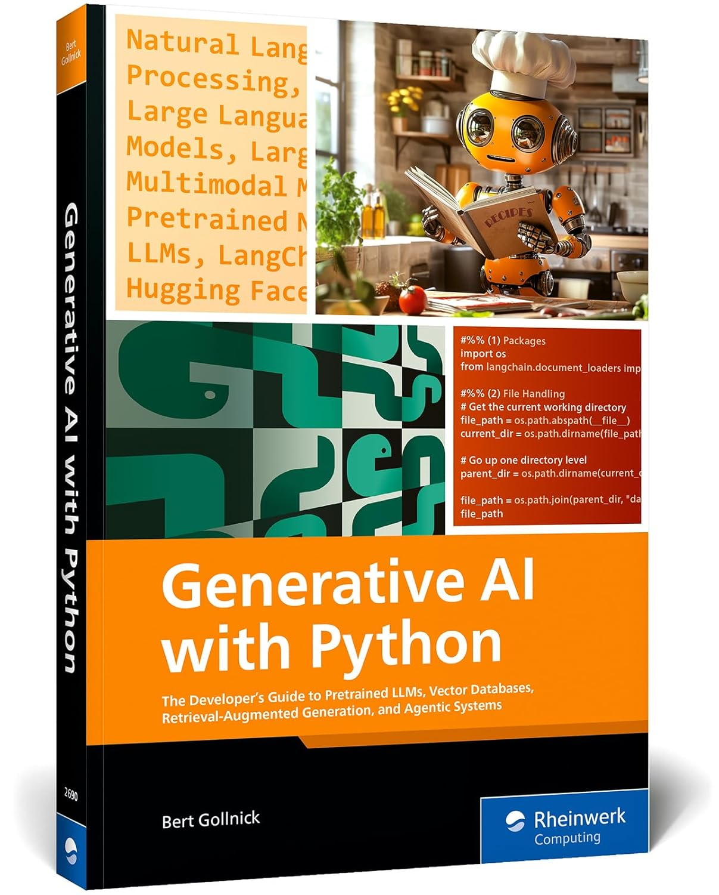
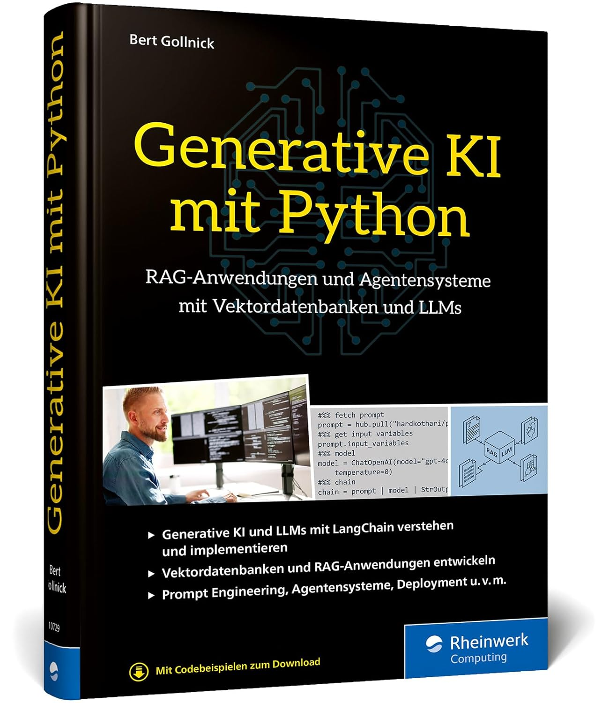

# Generative AI with Python

This is the accompanying book to the Udemy course.
<table>
  <tr>
    <td align="center">
      <a href="https://www.sap-press.com/generative-ai-with-python_6057/?irclickid=xWb30oxMvxycRtAW1lQdDXCVUksW5%3AQ02Q5DUE0&sharedid=&irpid=6210658&utm_medium=Affiliate&irgwc=1" target="_blank">
        <br/>
        <b>English Edition</b>
      </a><br/>
      <span>A comprehensive guide to generative AI concepts and coding in Python.</span>
    </td>
    <td align="center">
      <a href="https://gollnickdata.de/#/genai_book_de" target="_blank">
        <br/>
        <b>Deutsche Ausgabe</b>
      </a><br/>
      <span>Ein umfassender Leitfaden zu generativer KI mit Python.</span>
    </td>
  </tr>
</table>

# Setup

## Environment with uv

Install the required package:

```bash
pip install uv
```

Run the following command to install the dependencies:

```bash
uv sync
```

## Environment with venv

Use venv if uv is not working.

Create a virtual environment:

```bash
python -m venv venv
```

Activate the virtual environment on Linux:

```bash
source venv/bin/activate
```

Activate the virtual environment on Windows:

```bash
.\venv\Scripts\activate
```

Install the required packages:

```bash
pip install -r requirements.txt
```

